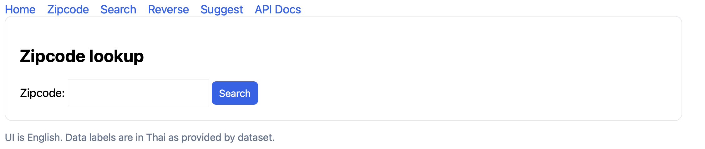
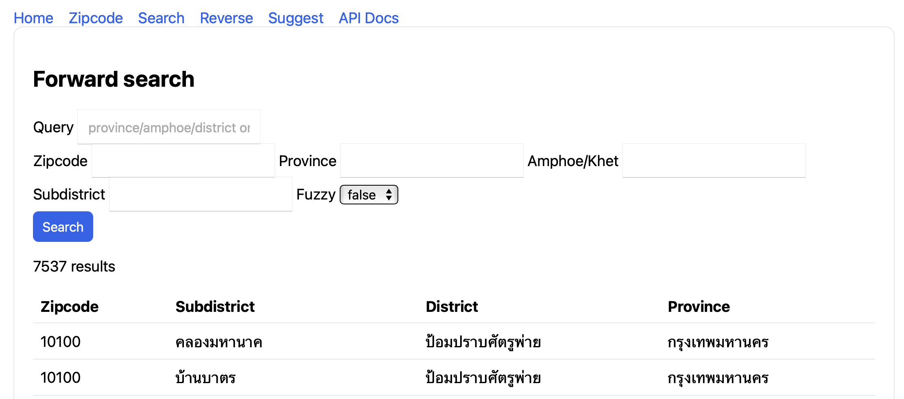
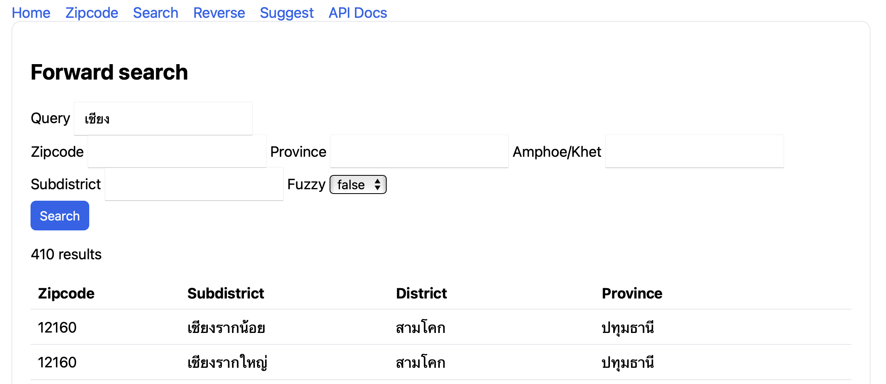
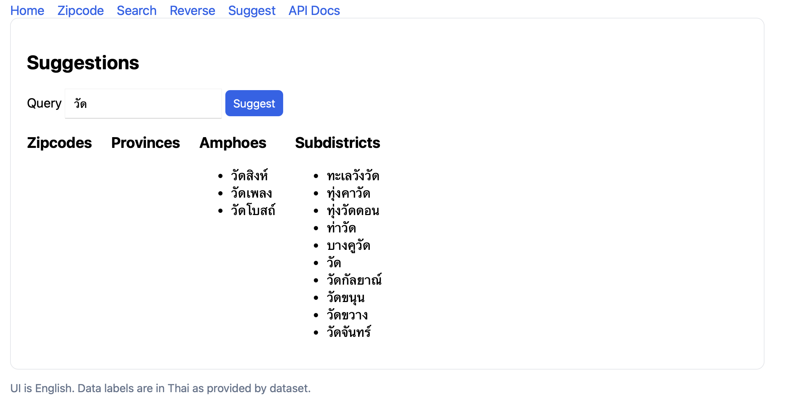

# Thai Zipcode Placefinder

A simple project to look up Thai places by zipcode and search addresses, with a clean separation between a REST API and a minimal web UI (Flask + Jinja).

## Quick start

```bash
cd /Users/ive/tmp/placefinder-th
python3 -m venv .venv
source .venv/bin/activate
pip install -r requirements.txt

# run the server on http://localhost:3000
python src/run.py
```

Open these pages:


- Home: `http://localhost:3000/`


- Zipcode: `http://localhost:3000/ui/zipcode`


- Search: `http://localhost:3000/ui/search`


- Reverse: `http://localhost:3000/ui/reverse`


- Suggest: `http://localhost:3000/ui/suggest`

## Data source

> [!IMPORTANT]
>
> Special thanks [mennwebs/th-address.json](https://gist.github.com/mennwebs/8ff8e27a01fd06ca2ac965a1c7317552) for who original TH-postalcode data source

The API loads Thai address data at startup from a public gist. Result labels (province/amphoe/district names) are in Thai. You can override the dataset URL:

```bash
DATA_URL="https://example.com/th-address.json" python src/run.py
```

For API details, see `ROUTE.md`.
