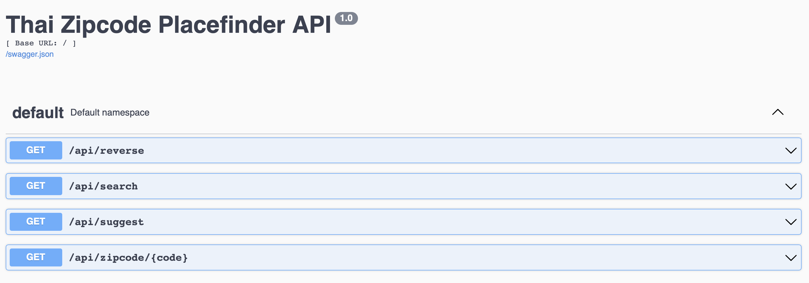

# API Routes

Base URL: `http://localhost:3000`

- All responses are JSON and UTF-8 encoded.
- Names of places are in Thai as provided by the data source.
- Explore interactively at Swagger UI: `/docs`



## GET /health
- Returns service status.
- Response:
```json
{ "status": "ok" }
```

## GET /api/zipcode/{code}
Lookup a zipcode and list related places.

- Path params:
  - `code` string, 5 digits, required
- Responses:
  - 200
    ```json
    {
      "code": "10110",
      "locations": [
        { "province": "กรุงเทพมหานคร", "amphoe": "คลองเตย", "district": "คลองตัน" }
      ]
    }
    ```
  - 400 `{ "error": "Invalid zipcode. Must be 5 digits." }`
  - 404 `{ "error": "Zipcode not found in dataset.", "code": "10110" }`

## GET /api/search
Forward search by free-text and/or structured fields.

- Query params:
  - `q` string, optional. Matches province/amphoe/district or zipcode prefix
  - `code` string, optional. Zipcode prefix filter
  - `province` string, optional
  - `amphoe` string, optional (district/khet)
  - `district` string, optional (subdistrict/khwaeng)
  - `fuzzy` boolean-like string, optional. One of `true,false,1,yes,y` (default: `false`)
  - `limit` integer, 1..200 (default: 50)
  - `offset` integer, >= 0 (default: 0)
- Response (200):
```json
{
  "total": 123,
  "limit": 50,
  "offset": 0,
  "results": [
    { "code": "10110", "province": "กรุงเทพมหานคร", "amphoe": "คลองเตย", "district": "พระโขนง" }
  ]
}
```

## GET /api/reverse
Reverse lookup zipcodes from address parts.

- Query params:
  - `province` string, optional
  - `amphoe` string, optional
  - `district` string, optional
  - `fuzzy` boolean-like string, optional (same as above)
- Responses:
  - 200
    ```json
    {
      "results": [
        {
          "code": "10110",
          "locations": [
            { "province": "กรุงเทพมหานคร", "amphoe": "คลองเตย", "district": "คลองตัน" }
          ]
        }
      ]
    }
    ```
  - 404 `{ "error": "No results found." }`

## GET /api/suggest
Return suggestions for zipcodes, provinces, amphoes, and districts.

- Query params:
  - `q` string, optional. If omitted, returns top items
  - `limit` integer, 1..20 (default: 10)
- Response (200):
```json
{
  "zipcodes": ["10110", "10200"],
  "provinces": ["กรุงเทพมหานคร"],
  "amphoes": ["คลองเตย"],
  "districts": ["คลองตัน"]
}
```

## Notes
- Data is loaded at startup from a public gist. Override via `DATA_URL` environment variable.
- All comparisons are case-insensitive; fuzzy matching is optional via `fuzzy=true`.
